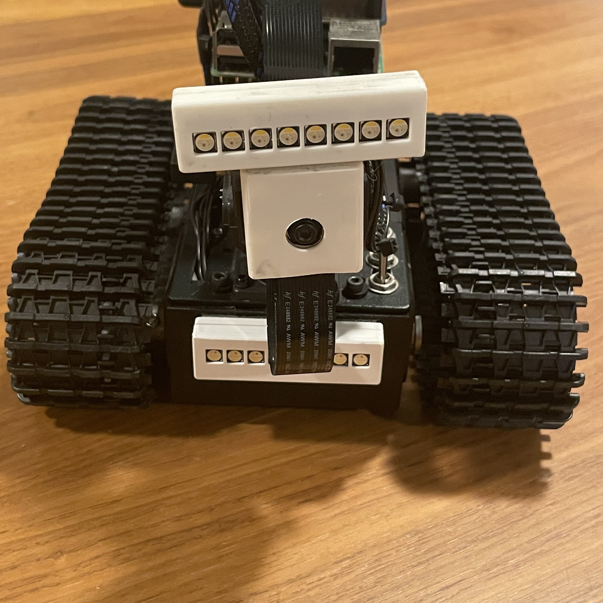
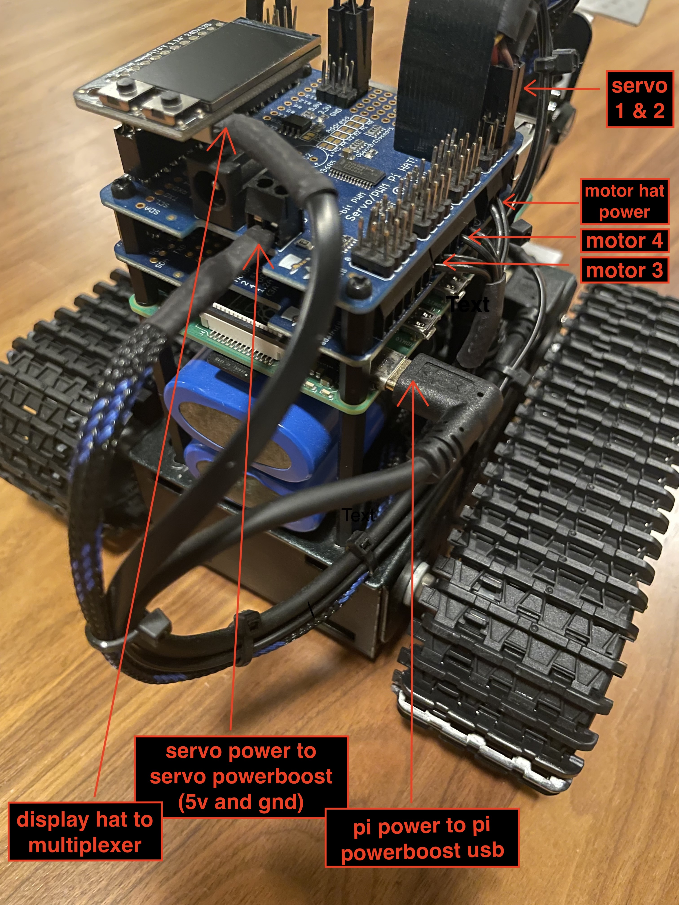
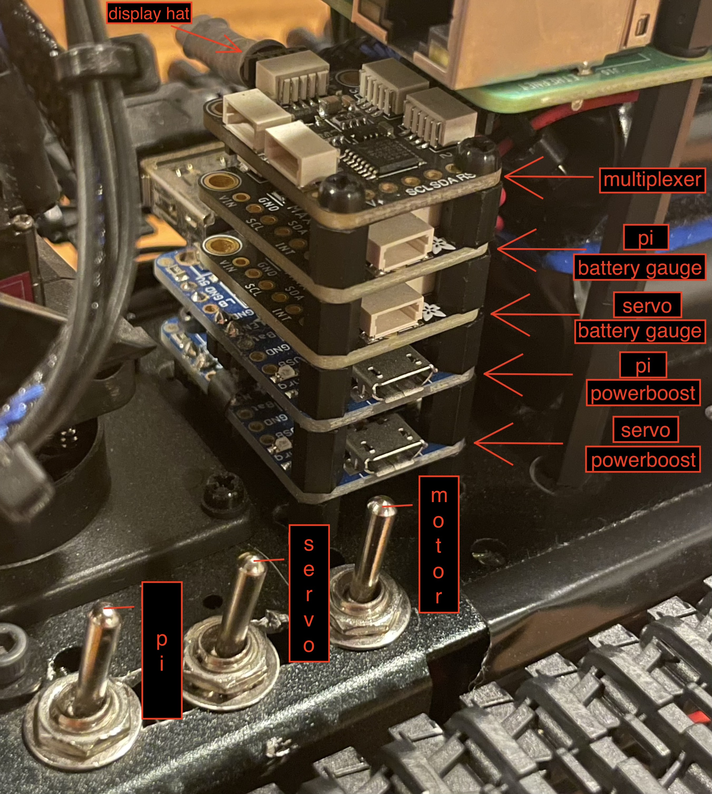
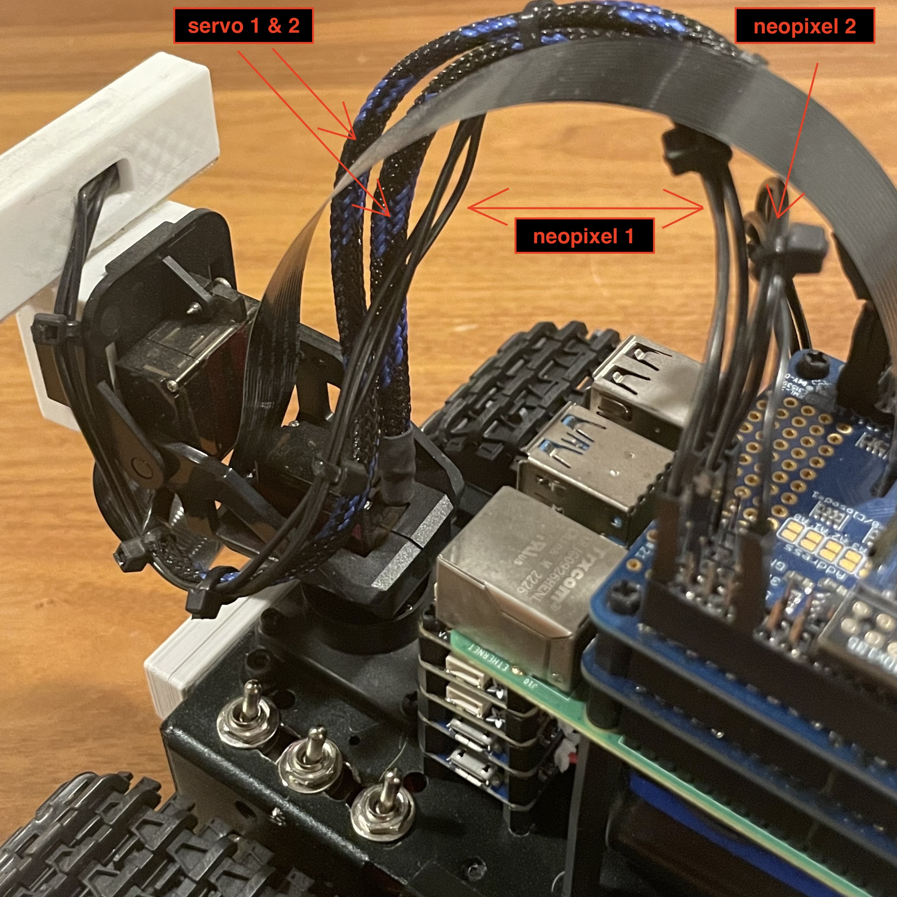
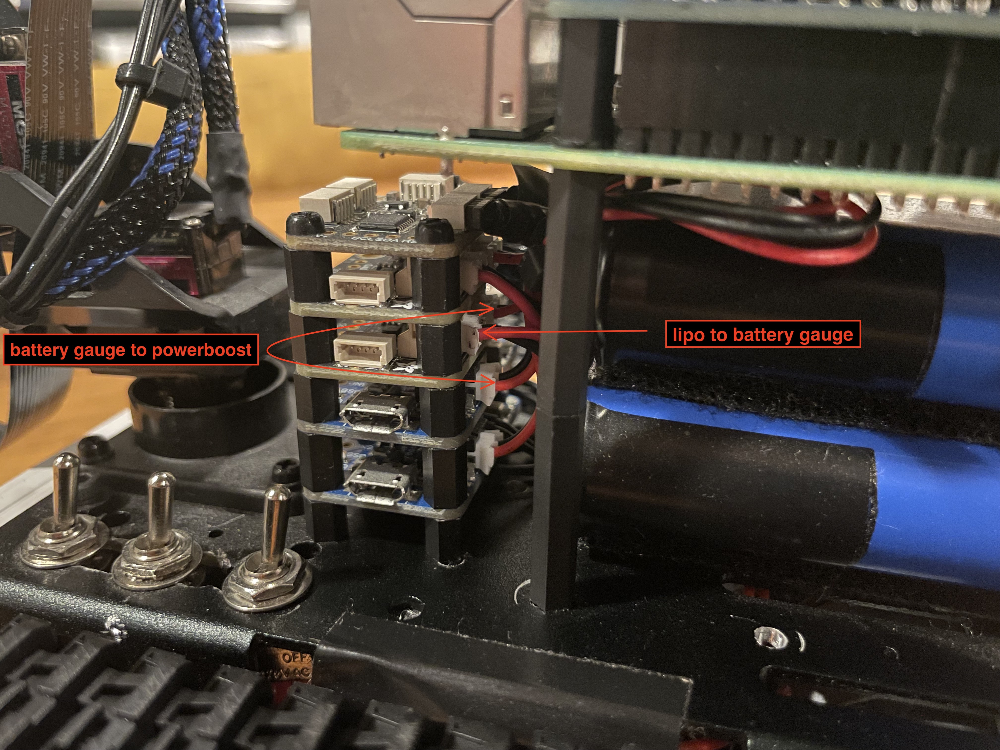
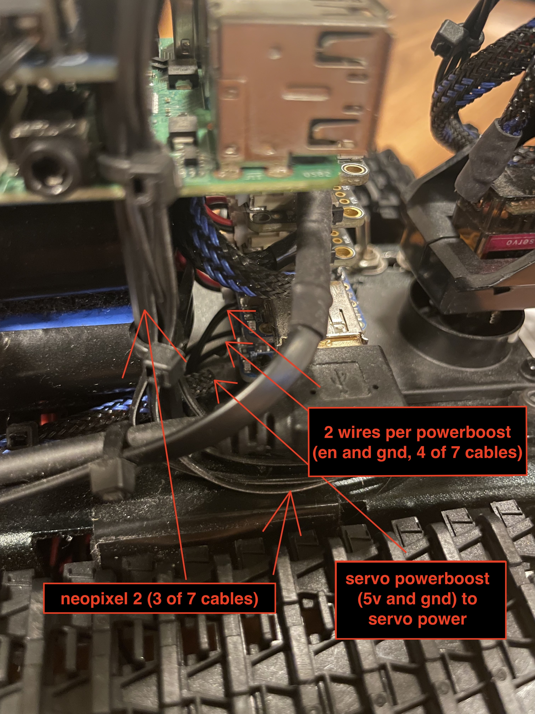
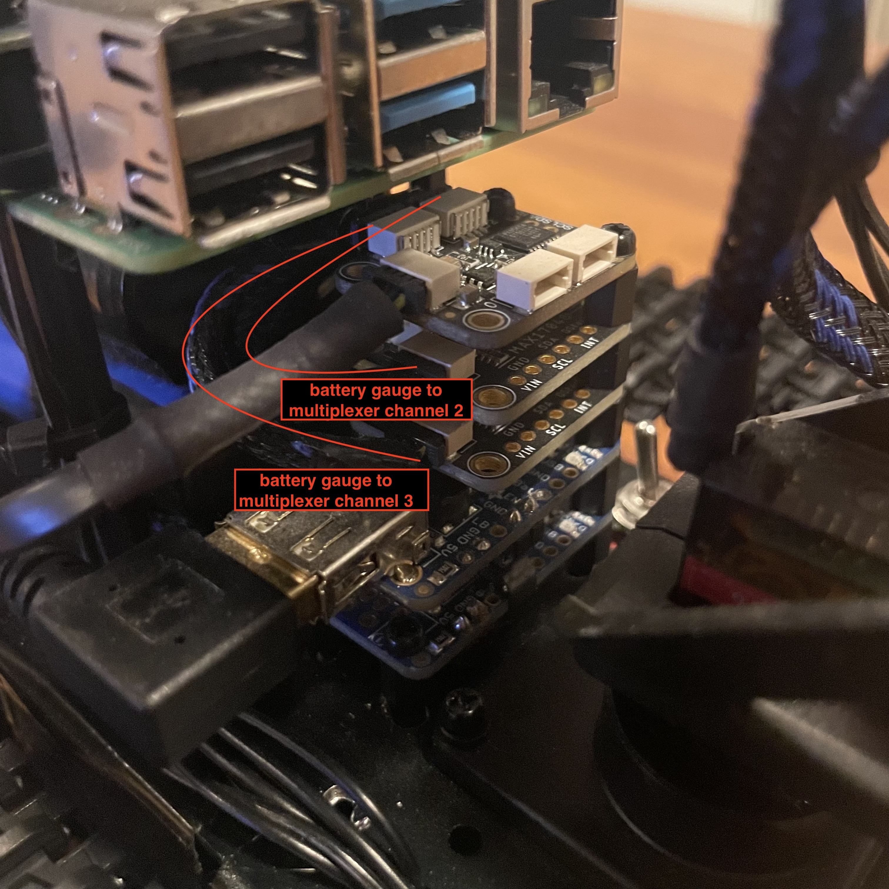

# Robot Project
<p align= "center" style="margin: 30px">

</p>

This robot project is controlled via a client web interface served at `http://robot-hostname.local:8000` using WebSockets. Using a hostname instead of an IP address makes it easy to connect, even through a mobile hotspot, when configuring or troubleshooting WiFi in the field.

For my setup, the robot pairs with a dedicated **Mission Control** Pi that acts as a robot client app. It sends battery sensor readings (for its own display and the Pi) over sockets and opens the robot’s web interface in a browser for control via four rotary encoders and four key switches.

🔗 [Mission Control repo here](https://github.com/clds84/mission_control_app)

> A regular laptop or desktop can also be used as a client if you don’t want to build Mission Control hardware.

## 📑 Table of Contents

1. [Setup (Overview)](#-setup-overview)
2. [Features](#features)
3. [Hardware](#hardware)
4. [3D Printed Parts](#3d-printed-parts)
5. [How to Build](#how-to-build)
6. [System Overview](#system-overview)
7. [How to Use](#how-to-use)
8. [Dependencies](#-dependencies)
9. [Service Files](#service-files---copy-in-system-and-user-services)
10. [Powering On for Use](#powering-on-for-use)
11. [Operating robot in a new environment](#operating-robot-in-a-new-environment)
12. [Controls for Laptop or Desktop](#controls-for-laptop-or-desktop)
13. [Code](#code)
14. [Troubleshooting](#troubleshooting)

## 🔧 Setup (Overview)

This project involves physical hardware, system services, and network setup. Use this section as a high-level checklist to guide your deployment.

1. **Assemble hardware**  
  Wire up all components according to the parts list and included `.stl` files for 3D-printed mounts and protection.

2. **Flash Raspberry Pi OS and configure WiFi**  
  Set up the robot Pi headlessly using a mobile hotspot to enable SSH access and configure primary WiFi with `nmcli`.

3. **Clone this repo and set up the environment**
  ```bash
  git clone https://github.com/clds84/robot_app
  cd robot_app
  python3 -m venv venv
  source venv/bin/activate
  pip install -r requirements.txt
  ```
4. **Copy services**

    Copy `app.service, stream.service`, and `display_hat_stats.service` into `~/.config/systemd/user/` 
    Copy `neopixel.service` into `/etc/systemd/system/` (must run as root)
5. **Enable and start services**

    For user-level services:
    ```bash
    systemctl --user enable app.service stream.service display_hat_stats.service
    systemctl --user start app.service steam.service display_hat_stats.service
    ```
    For root-level service
    ```bash
    sudo systemctl enable neopixel.service
    sudo systemctl start neopixel.service
    ```
6. **Power on devices**

    Boot up both the robot Pi and the Mission Control Pi (if used).
7. **Access the robot interface**

    Open a browser and go to:
    `http://robot-hostname.local:8000`
8. **Operate the robot**

    Use key controls with a Mission Control, laptop, or desktop described below to drive motors, control motor speed, adjust servos, toggle LEDs and control brightness.

## Features

- WebSocket-based communication between robot and client
- Local web interface (`index.html`) served by the robot
- Integrated camera stream via `stream.py`
- Handles onboard logic for:
  - DC motors (4-wheel drive)
  - Pan/tilt servos for camera
  - NeoPixel LED sticks
- Emits battery sensor readings over sockets
- Receives sensor input (e.g., Mission Control battery levels) over sockets (if using Mission Control client)

## Hardware

- [Raspberry Pi 4]()
- [Adafruit DC Motor HAT]()
- [Adafruit Servo HAT]()
- [Pi Camera]()
- [Pan/tilt servo bracket]()
- [2 DC motors (one per side)]()
- [2 servo motors (for X and Y axes)]()
- [2 Adafruit NeoPixel sticks]()
- [2 Adafruit PowerBoost chargers (for Lithium Polymer (LiPo) battery)]()
- [2 Adafruit battery gauge monitors]()
- [Adafruit I2C multiplexer]()
- [Adafruit display HAT (for WiFi status and battery voltage)](https://www.adafruit.com/product/4393?gad_source=1&gad_campaignid=21079227318&gbraid=0AAAAADx9JvRDay4yWQW0YeAwewaAP5-il&gclid=CjwKCAjw9anCBhAWEiwAqBJ-c-nwN4CdOir3CDpunkb8d08L5X6cP68mcPEqfggrbiRtG0R4XL0BXRoCufMQAvD_BwE)

## 3D Printed Parts

Included `.stl` files for:

- Camera housing  
- NeoPixel stick holders  
- Underbody chassis cover (motor protection)  

> **Note:** The underbody is a quick solution for protection. It can be a little tedious to remove/install but functional.

## How to Build

Please refer to the included photos for build guidance. Since chassis types may vary, I didn’t document the mechanical build step-by-step, but the photos will provide some insight. 

**Tips:**

- **Breadboard or loosely wire** all components first to test functionality before permanent mounting.
- Use a **jumper wire kit** and proper standoffs for organization and flexibility.
- You may need a **conical file** to widen mounting holes on the battery gauges or multiplexer to fit standoffs.
- The **display HAT** might seem redundant since battery data is also shown in the web interface, but it’s useful for checking battery level before/after shutdown, or confirming WiFi connection with a button press.
- **Power stacking**: The PowerBoost, battery gauges, and multiplexer stack cleanly using standoffs when aligned properly.

---

### Back Right 


This image shows the Display HAT stacked on the servo HAT, which is on top of the DC motor HAT, all mounted on the Raspberry Pi.  Other connection points for servo power, the display HAT, and the Pi power, are shown more clearly in later images. 

The six wires, two per DC motor, plus one for power and one for ground, run down straight down under the chassis. 

The **servo 1 & 2 wires** in the top right of the image come from the servo motors and are also shown more clearly in later images. The headers on this side of the servo HAT correspond to the 16-channel servo layout, and each row includes power, ground, and signal.

The camera ribbon runs through a slit in both the dc motor and servo HATs. 

---

### Multiplexer/Battery Gauge/Powerboost Stack


This image shows:
  - Toggle switches for pi
  - Multiplexer
  - Battery gauges
  - Pi PowerBoost
  - Servo PowerBoost
  
  The power and ground wires for the DC motor ([motor wires](#back-right)) are connected to the motor toggle switch under the chassis. The toggle switches for the Pi and servo will be mentioned again.

---

### Top Left


The wires identified in this image are for:
  - NeoPixel 1 and 2 
  - Servo 1 and 2

Each Neopixel has a power, ground, and signal wire connected to the headesr on the servo HAT which correspond to the Pi's GPIO layout. The signal wire for NeoPixel 1 is connected to D21 and the one for NeoPixel 2 is connected to D12.

The wires for NeoPixel 2 will be mentioned again in a later image.

---
### Side View 


Connect the LiPo JST connector to the battery gauge, then a JST cable from the battery gauge to the PowerBoost (these are the steps per battery gauge/PowerBoost combo).

---



Wires identified for:
  - Neopixel 2 [NeoPixel connection on HAT](#top-left)
  - Servo power ([Servo power](#back-right)) - use 5v and GND pins
  - PowerBoosts - use EN & GND pins

For aesthetic purposes, 90-degree headers are soldered to the bottom of each PowerBoost, facing inward toward the midline.

> **Note:** The EN and GND pins used for each PowerBoost (Pi and servo) run under the chassis and connect to the Pi and servo toggle switches. The difference between these and the motor switch is that the motor switch does not utilize a PowerBoost; instead, it enables power directly from the LiPo to the DC motor HAT, with no intermediary connections to be made. However, for the Pi and servo, the EN and GND will result in a LOW reading when the toggle switch is operated, and that will allow power from LiPo -> PowerBoost -> Pi/servo. The reason for doing this is to control the HIGH position when not using the robot and/or charging the LiPo batteries. If the toggle switch is in an OFF position, the PowerBoosts will not transfer voltage to the servo Hat or the Pi. However, the PowerBoosts will be operational for charging, via headers or the micro-usb port.

---

### Front Right


Short QT Stemma connectors are used here to connect the battery gauges to the multiplexer. 

---


## System Overview

```text
[Mission Control Pi] --> [WebSocket] --> [Robot Pi]
       |                                     |
[Encoders + Keys]                    [Motors, Servos]
[Battery Gauges]                     [Camera + Stream]
                                     [NeoPixels, Battery Gauges]

--------------------------OR------------------------------------

[generic client] --> [WebSocket] --> [Robot Pi]
       |                                     |
    [Keys]                           [Motors, Servos]
                                     [Camera + Stream]
                                     [NeoPixels, Battery Gauges]
```

## How to Use

> See below for setting up WiFi if not using a wired connection and for operating robot in WiFi environments

### (Optional) Use a Virtual Environment

To avoid polluting your system Python, use the following in robot_app/:

```bash
cd robot_app
python3 -m venv venv
source venv/bin/activate
pip install -r requirements.txt
```

### 🧰 Dependenciess

#### 📎 **Dependencies to **Import** (Python Standard Library – no installation needed)**

These modules are part of Python 3 and do **not** require separate installation:

- `os`
- `sys`
- `time`
- `logging`
- `signal`
- `subprocess`
- `io`
- `threading`
- `atexit`
- `socketserver`
- `http.server`
- `Condition` (from `threading`)

> These modules are included with any modern Python 3 installation.

### 📦 Dependencies to **Install** (Third-Party Packages)

This project requires the following main Python packages, which are included in the requirements.txt file:

- `flask`
- `flask_socketio`
- `Pillow` (for image manipulation, imported as `PIL`)
- `adafruit-blinka`
- `adafruit-circuitpython-motorkit`
- `adafruit-circuitpython-servokit`
- `adafruit-circuitpython-max1704x`
- `adafruit-circuitpython-tca9548a`
- `adafruit-circuitpython-rgb-display`
- `adafruit-circuitpython-neopixel`
- `picamera2` (may require additional OS-level setup)

You can install these dependencies with:

```bash
pip install -r requirements.txt
```

### Service Files - copy in system and user services

`app.service, stream.service`, and `display_hat_stats.service` should be copied in `~/.config/systemd/user/`, however `neopixel.service` should be installed in `/etc/systemd/system/`because it has to be run as root. 

> Run `update_service.sh` to copy the latest versions of all service files from this repo into the correct system/user directories.

### Powering On for Use

- Once the above steps have been completed, the robot Pi automatically runs `app.py` and `stream.py` web interface at `http://robot-hostname.local:8000` through user services. `neopixel_setup.py` runs as a separate service at root level as root privileges are required for it to work. **Note:** Do not name your file `neopixel.py` or it will conflict with the Adafruit NeoPixel module.
- SSH can be used to troubleshoot and is used to shutdown devices. Termius is a good mobile app for communication if out in the field. 

### Operating robot in a new environment

- first step after boot is to setup WiFi. If running headless:
  - Use mobile hotspot when flashing OS that will serve as a temporary SSH session when in the field in order to setup the primary WiFi in that environment.
  - Make use of WiFi script including `nmcli` commands. 
  - Once the WiFi script has been used, adjust WiFi priority value with `nmcli connection modify <connection_name> connection.autoconnect-priority: <number>` (**Note:** higher value means higher priority. This will avoid hiccups if the hotspot is still on and has a higher priority than the new WiFi connection.) 

After WiFi setup, the web interface will be properly served and `http://robot-hostname.local:8000` will include the stream from `stream.py` and the battery gauge readings from the robot and Mission Control (if applicable) broadcast via WebSockets. The User Interface (UI) is designed primarily for Mission Control's 7" display, so it might feel light on a laptop or desktop. There is room for improving those use cases if preferred over Mission Control, including click events as an alternative to key down/up events. 

### Controls for Laptop or Desktop

> **Note:** Mission Control uses rotary encoders for all key down/up functionality below, except for the WASD keyboard layout for Forward-Left-Backward-Right, which follows an ortho-linear QWERTY layout. 

The interface is minimal because Mission Control uses physical rotary encoders, not on-screen controls.

#### Motor Movement
- <kbd>W</kbd> – Move robot forward
- <kbd>A</kbd> – Turn robot left
- <kbd>S</kbd> – Move robot in reverse
- <kbd>D</kbd> – Turn robot right
- <kbd>W</kbd> – Move robot forward

#### Camera Movement
- <kbd>J</kbd> – Rotate camera left
- <kbd>L</kbd> – Rotate camera right
- <kbd>I</kbd> – Tilt camera up
- <kbd>K</kbd> – Tilt camera down
- <kbd>N</kbd> – Reset camera to center position.

#### LED Control
- <kbd>Z</kbd> – Toggle LED strip
- <kbd>X</kbd> - Decrease LED strip brightness
- <kbd>C</kbd> - Increase LED strip brightness

#### Speed Control
- <kbd>F</kbd> – Toggle motor speed range
- <kbd>G</kbd> - Decrease motor speed
- <kbd>H</kbd> - Increase motor speed

### Code

- The Logic for interpreting control inputs and sending data is located in `app.py`.

- Sensor readings from Mission Control’s battery gauges are sent to the robot in real-time via WebSocket. To avoid errors when a Mission Control client is not used, there is a conditional check in `templates/index.html`:

```
// Battery reading from Mission Control
socket.on('battery_update_mc', (data) => {
    const mcEl = document.getElementById('battery-status-mc')
    if (mcEl) {
        mcEl.innerHTML = data.battery;
        console.log("Got mision control update:", data);
    }
});
```

- Depending on your use case, you may want to adjust the camera resolution (`width` x `height` in `picam2.configure(...)`) and the `` element dimensions in the HTML (`width`x `height` attributes) accordingly.

- For debugging or to check events in realtime, use app.log and neopixel.log that will be created in `robot_app/logs/` when services run. Make sure to uncomment lines such as: `logger.info('Current motor speeds: %s, %s', motor3Speed, motor4Speed)`

### Troubleshooting